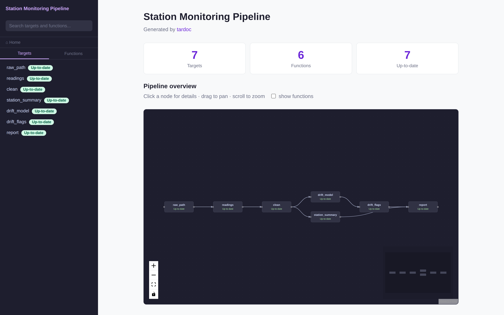

# tardoc

<!-- badges: start -->
[](https://github.com/CathalByrneGit/tardoc/actions/workflows/R-CMD-check.yaml)
[](https://github.com/CathalByrneGit/tardoc/actions/workflows/lint.yaml)
[](https://cathalbyrnegit.github.io/tardoc/)
<!-- badges: end -->

Auto-generate documentation for any [targets](https://docs.ropensci.org/targets/)
pipeline. Point tardoc at your project and get structured markdown, a browsable
HTML viewer, and — optionally — a full analytics stack with SQL queries, semantic
search and an LLM chat interface.

```r
# install.packages("remotes")
remotes::install_github("CathalByrneGit/tardoc")

tardoc::document_targets(pkg_name = "My pipeline")
tardoc::view_tardoc()
```



Nothing in that screenshot is hand-written: every page, badge and graph comes
from `_targets.R` and the roxygen comments in `R/`. It is the example pipeline in
[`inst/examples/station-monitoring`](https://github.com/CathalByrneGit/tardoc/tree/main/inst/examples/station-monitoring), published
on every push — open the
**[live demo](https://cathalbyrnegit.github.io/tardoc/example/)**.

## What you get

`document_targets()` writes one `.md` per target and per function, plus two
self-contained HTML files that open as `file://` — no server, no R on the
reader's side:

- **The viewer.** An interactive React Flow graph of the pipeline, a sidebar that
  stays usable at several hundred targets, fuzzy search, and a page per target and
  per function carrying status, timings, sizes, errors, per-branch detail, the
  critical path, a diff against the previous build, and function source *with its
  comments intact*.
- **Freshness, not just errors.** Every target reads `Up-to-date`, `Outdated`,
  `Errored` or `Not built`, so a target invalidated by an upstream change is
  visible before you run anything.
- **A WASM analytics page.** DuckDB in the browser: SQL, dplyr syntax, BM25
  search and recursive lineage queries over the pipeline.
- **`llms.txt`** at the project root, for pasting a pipeline into an LLM
  conversation.

Three optional layers go further: a live DuckDB server with semantic search, an
LLM chat tab, and the pipeline database as an MCP server for Claude Desktop and
Claude Code.

A store does not have to exist. `tar_manifest()` and `tar_network()` read
`_targets.R` alone, so a pipeline that has never been run documents fully — with
every target reading `Not built`, which is accurate rather than a gap.

## Documentation

Full documentation is at
**[cathalbyrnegit.github.io/tardoc](https://cathalbyrnegit.github.io/tardoc/)**:

- [Get started](https://cathalbyrnegit.github.io/tardoc/get-started.html) —
  install, what gets written, and whether you need a store
- [The viewer](https://cathalbyrnegit.github.io/tardoc/viewer.html) — every page
  of it, and how the sidebar and graph behave at 420 targets
- [Analytics, chat and MCP](https://cathalbyrnegit.github.io/tardoc/analytics.html)
  — SQL, semantic search, the chat tab, the MCP server
- [Publishing](https://cathalbyrnegit.github.io/tardoc/publishing.html) —
  regenerating the docs in CI so they cannot drift
- [Manual](https://cathalbyrnegit.github.io/tardoc/manual.html) — every exported
  function
- [Design notes](https://cathalbyrnegit.github.io/tardoc/notes/) — why the graph
  is React Flow, how Quack remote access works, and what it would take to publish
  a whole targets project to the browser
- [Playground](https://cathalbyrnegit.github.io/tardoc/playground/) — tardoc
  running in your browser, under webR

## Licence

MIT. See [LICENSE](https://github.com/CathalByrneGit/tardoc/blob/main/LICENSE).
