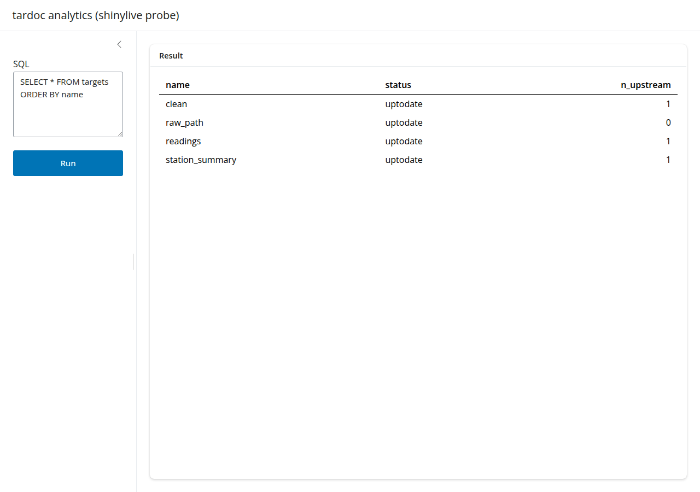

# Should tardoc use shinylive?

**Recommendation: no — not as a replacement for any existing tier.** There is one
narrow case where it earns its place, and it is not the one it looks like at
first glance. Details below; every number here was measured in this repo, not
quoted from documentation.

Evaluated against shinylive 0.5.0, webR 0.5.4 (R 4.5.1), on
`repo.r-wasm.org` as of 2026-09-05.

---

## What was actually tested

Two Shiny apps were exported with `shinylive::export()` and driven in a real
headless Chromium: a minimal one (`shiny` + `bslib`), and one that opens a live
DuckDB connection and runs user-supplied SQL. The harness is committed under
[`tools/shinylive-probe/`](../tools/shinylive-probe) so these figures can be
re-checked rather than taken on trust.

It works. R boots in the browser, DuckDB runs, SQL returns rows:



That is the important thing to say first, because the rest of this document
argues against adopting it, and the argument is not "it doesn't work."

---

## Measured cost

| | Measured |
|---|---|
| Export, `shiny` + `bslib` | **66 MB**, 189 files |
| Export, + `duckdb` + `DBI` | **77 MB** |
| Bytes over the wire before first paint | **51.5 MB** across 50 requests |
| Cold boot to interactive | **30.5 s** — on `localhost`, so no network latency |
| `R.wasm` | 17.2 MB |
| `library.data.gz` | 14.4 MB |
| `duckdb_1.5.2.tgz` | 9.4 MB |

For comparison, tardoc's current tier 2 is a single self-contained HTML file
that opens instantly.

### Dependency closures

Resolved from the `repo.r-wasm.org` `PACKAGES` index for R 4.5 (23,559 packages
available), following `Depends` + `Imports` + `LinkingTo`:

| Root set | Packages | R packages |
|---|---:|---:|
| `shiny` (+ `bslib`, `jsonlite`) | 30 | 20.3 MB |
| + `duckdb`, `DBI`, `dplyr` | 40 | 33.7 MB |
| + `targets` | 59 | 47.6 MB |
| + `visNetwork`, `gt`, `ellmer` | 84 | 76.4 MB |

> **If you re-run this, mind one trap.** The index contains a package called
> `webr` which is *not* the webR bridge — it is Keon-Woong Moon's unrelated CRAN
> package of the same name, and it imports `moonBook`, `ggpubr`, `flextable` and
> a long statistical tail. The WASM build of `httpuv` declares `webr` as an
> import, meaning the bridge. A naive resolver follows the CRAN one and inflates
> every closure by ~140 packages and ~130 MB. The first pass of this analysis
> did exactly that and reported 152 MB for `shiny` alone. The real figure is
> 20.3 MB.

---

## The three findings that decide it

### 1. It cannot do `file://`

This was tested directly, not read off a page. Loading the export from a
`file://` URL gives `crossOriginIsolated: false`, `SharedArrayBuffer:
undefined`, a blank page, and `net::ERR_FAILED` on the module scripts.

Serving it also required setting cross-origin isolation headers explicitly:

```
Cross-Origin-Opener-Policy: same-origin
Cross-Origin-Embedder-Policy: require-corp
```

Tiers 1 and 2 exist precisely because they open as `file://` with no server.
Shinylive cannot deliver that promise, so it cannot replace them — it is
strictly worse for the job they do.

### 2. Tier 2 already does the headline feature, in JavaScript, for free

The obvious pitch is "DuckDB analytics in the browser." tardoc already ships
that: `wasm_analytics.html` runs DuckDB-WASM directly from JS, embeds the
pipeline data, and opens as `file://`. Routing the same queries through 34 MB of
R packages to reach the same DuckDB is not an improvement — it is the same
capability at four orders of magnitude more weight and a 30-second wait.

### 3. `tar_watch` parity is not achievable, and that matters

[`tar_watch_server.R`](https://github.com/ropensci/targets/blob/main/R/tar_watch_server.R)
is built on `shiny::invalidateLater()` polling `tar_progress()` and `tar_meta()`
against a live `_targets/` store on disk. Its entire purpose is watching a
pipeline *while it runs*.

A browser has no live store and no running pipeline. A shinylive port would poll
a frozen snapshot on a timer — the mechanism without the point. (Incidentally
`pingr`, which `tar_watch` uses, has no WASM build; but that is a detail beside
the semantic problem.)

---

## What shinylive would genuinely unlock

Being fair to it, two things are real and neither is available today.

**`targets` introspection without an R install.** `targets` 1.12.0 *is*
available as a WASM binary. A hosted page could run `tar_network()` and
`tar_meta()` against a store the reader uploads, letting someone explore a
pipeline's structure with no R on their machine. tardoc currently cannot offer
that to a reader who does not already have R.

**Reuse of tardoc's own R code.** Tier 2's analytics logic is currently
reimplemented in JavaScript inside `wasm_analytics.html`, duplicating what the R
side already computes. A shinylive tier could call the R functions directly and
delete that duplication.

**But there is a blocker on the second one.** `tardoc` is not on CRAN, so it is
not in `repo.r-wasm.org` (confirmed: no such entry in the index). webR cannot
install from source. Using tardoc's own functions in a shinylive app means
either vendoring the R sources into the app directory, or publishing WASM
binaries somewhere. Neither is free, and both need a maintenance story.

---

## Tier 4 is a poor fit specifically

The LLM chat tier should not go this route:

- webR cannot make arbitrary HTTP requests. [`quarto-live-curl`](https://github.com/georgestagg/quarto-live-curl)
  works around it with `coi-serviceworker` for cross-origin isolation plus a
  **WebSocket proxy** — which reintroduces exactly the server that going
  browser-side was meant to remove.
- An API key reaching `ellmer` in the browser is a key shipped to the client.
  Tier 4 keeps credentials server-side today, and that is the right call.

---

## If it is adopted anyway

Keep it additive and explicit. Do not fold it into an existing tier.

- A separate `generate_shinylive_export()` behind an opt-in argument, writing to
  `tardoc/shinylive/`, never part of the default `document_targets()` run.
- `shinylive` in `Suggests`, guarded with `requireNamespace()` like `duckdb` and
  `ellmer` already are.
- Documented as **requiring a web server that sets COOP/COEP** — a plain static
  host will serve the files and then fail at runtime, which is a miserable thing
  to debug. GitHub Pages needs `coi-serviceworker` for this reason.
- Never committed to the package tarball. A 77 MB export inside an R package is
  a non-starter for CRAN and unpleasant everywhere else.
- The scope worth building first is the reader-uploads-a-store case, since that
  is the only thing here tardoc cannot already do.

## Verdict

The technology works and the demo above is real. It is simply aimed at a
different problem than tardoc's. tardoc's tiers are ordered by how little
infrastructure the reader needs; shinylive sits *below* tier 3 on that axis —
more setup than a static file, more weight than a served page, and it still
cannot watch a running pipeline. Revisit if webR gains a smaller base image, or
if the upload-a-store use case becomes something users actually ask for.

---

## Reproducing these numbers

```sh
Rscript -e 'install.packages("shinylive")'
Rscript -e 'shinylive::export("tools/shinylive-probe/app-db", "site-db")'
du -sh site-db
python3 tools/shinylive-probe/serve.py          # serves site-db with COOP/COEP
node tools/shinylive-probe/probe.mjs            # boots it, runs a query, times it
```

## References

- [webR 0.5.4 release notes](https://tidyverse.org/blog/2025/07/webr-0-5-4/) — R 4.5.1, Emscripten 4.0.8
- [posit-dev/shinylive](https://github.com/posit-dev/shinylive)
- [targets `tar_watch_ui.R`](https://github.com/ropensci/targets/blob/main/R/tar_watch_ui.R) / [`tar_watch_server.R`](https://github.com/ropensci/targets/blob/main/R/tar_watch_server.R)
- [georgestagg/quarto-live-curl](https://github.com/georgestagg/quarto-live-curl) — webR networking via WebSocket proxy
