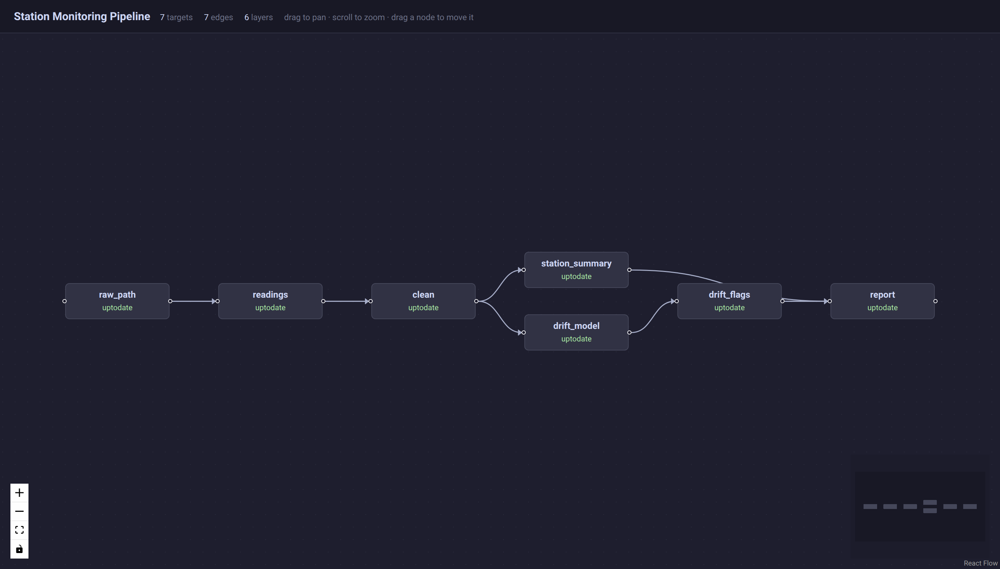
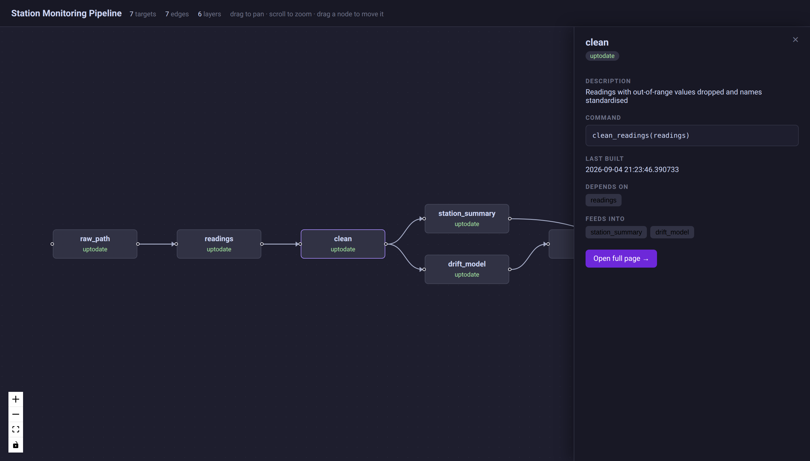

# React Flow pipeline graph

Working code, not a proposal, borrowed from
[dplyneage](https://github.com/tgerke/dplyneage). Additive: `document_targets()`
still produces exactly what it did before.

---

## React Flow instead of mermaid

`generate_reactflow_graph()` writes `reactflow_graph.html` — the target DAG as
an interactive graph.



### Why

mermaid is the single heaviest thing tardoc's viewer loads.

| Asset | Size |
|---|---:|
| `mermaid@11.17.2` | **3,488.9 KB** |
| `reactflow@11.11.4` UMD | 151.6 KB |
| `react-dom@18.3.1` UMD | 128.7 KB |
| `react@18.3.1` UMD | 10.5 KB |
| React Flow `style.css` | 9.0 KB |
| **React Flow total** | **299.8 KB** |

**11.6× smaller**, and the result is genuinely interactive: drag nodes, pan,
zoom, minimap, per-node status colouring — rather than a static SVG inside the
expand-modal the current viewer hand-rolls around mermaid.

The generated page itself is 6.3 KB for the example pipeline.

### The cost, stated plainly

**React Flow does no layout.** Every node must arrive with an `(x, y)`. mermaid
does that for you, and giving it up is the real price of the swap.

It is a small price here because a targets pipeline is a layered DAG.
`dag_layout()` assigns each node a column by longest-path depth from a root,
stacks nodes within a column, and centres each column against the tallest. That
is ~40 lines, and it is the same approach dplyneage uses in its
`layout_positions()`.

```r
dag_layout(
  nodes = c("a", "b", "c"),
  edges = data.frame(from = c("a", "b"), to = c("b", "c"))
)
#>   name layer   x  y
#> 1    a     0   0  0
#> 2    b     1 220  0
#> 3    c     2 440  0
```

`build_dag_graph()` turns `load_targets_data()` output into the
`{nodes, edges}` shape the page consumes.

### One finding worth recording

**Use React Flow v11, not v12.** The v12 UMD build's browser branch expects a
`jsxRuntime` global:

```js
t((e=globalThis).ReactFlow={}, e.jsxRuntime, e.React, e.ReactDOM)
```

React 18's UMD build does not expose one (checked — no `jsxRuntime` in the
bundle), so v12 needs a shim or a bundler. v11 asks only for `React` and
`ReactDOM` and drops straight in.

That is also why dplyneage ships its own 347 KB webpack bundle with React rolled
in. tardoc doesn't need to: v11's UMD loads from CDN with subresource integrity,
matching how `viewer.html` already loads mermaid and fuse.js.

### Click a node to inspect it

Clicking a node opens a panel with what you would otherwise have to go and look
up:



- description and the R command that builds it
- status and last build time, with the error when there is one
- **Depends on** / **Feeds into** as clickable chips — clicking one moves the
  panel to that neighbour, so you can walk the pipeline without leaving the graph
- **Open full page →**, linking into the viewer

Close with the × or Escape, or by clicking empty canvas.

### Deep links into the viewer

The panel's link only means something if the viewer can be told which page to
open, so `viewer.html` now reads and writes a location hash:
`viewer.html#targets:clean` opens that target directly, and clicking a page in
the viewer records it in the hash so the URL can be shared or reloaded.

That is useful on its own, independent of this graph — it is the first time any
tardoc page has been directly linkable.

Verified in a browser: deep link on load, `hashchange` while open, clicking a
nav item writing the hash back, and a hash naming a target that does not exist
falling back to the home panel rather than erroring.

### Not done

This is a **separate page**, not a replacement. `viewer.html` still uses mermaid
for both the overview and the per-target graphs. Swapping it properly means
porting the per-target local graphs and the expand modal too, and deciding
whether to keep mermaid for the markdown pages, which embed ```mermaid fences.

---

## Reproducing

```r
# React Flow graph for the bundled example pipeline
setwd(system.file("examples/station-monitoring", package = "tardoc"))
targets::tar_make()
cfg <- build_site_config(".")
generate_reactflow_graph(load_targets_data(cfg), cfg, "Station Monitoring Pipeline")
```

Covered by `tests/testthat/test-dag_layout.R`.
