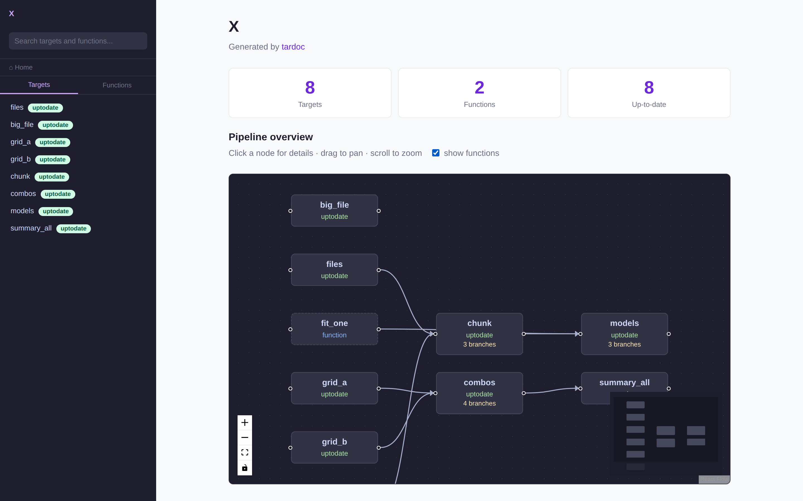
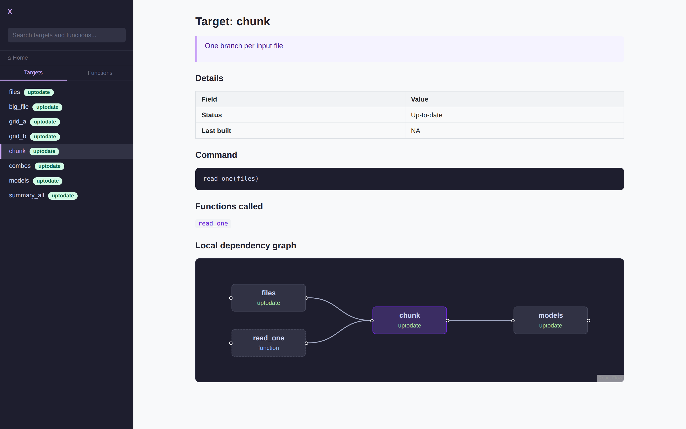

# React Flow pipeline graph

The pipeline overview in `viewer.html` is now rendered with
[React Flow](https://reactflow.dev) instead of mermaid. Clicking a target opens
a detail panel; the standalone `generate_reactflow_graph()` page remains for a
full-screen view.

Borrowed from [dplyneage](https://github.com/tgerke/dplyneage), which renders
column-level lineage the same way.



---

## Why replace mermaid

| Asset | Size |
|---|---:|
| `mermaid@11.17.2` | **3,488.9 KB** |
| `reactflow@11.11.4` UMD | 151.6 KB |
| `react-dom@18.3.1` UMD | 128.7 KB |
| `react@18.3.1` UMD | 10.5 KB |
| React Flow `style.css` | 9.0 KB |
| **React Flow total** | **299.8 KB** |

**11.6× smaller**, and genuinely interactive: drag nodes, pan, zoom, minimap,
per-node status colouring.

**mermaid is no longer loaded at all.** The per-target pages still carry a
```mermaid fence, so the generated `.md` files render on GitHub and anywhere
else markdown is read — that portability was worth keeping. The viewer ignores
the fence's contents and replaces it with a React Flow graph built from the same
data:



So the full 3,488.9 KB is reclaimed, and the `.md` files lose nothing.

## What a node shows

Node bodies carry name, status, and a branch count when the target is branched.
Clicking opens a panel with:

- **description** and the R **command**
- **Branching** — the `pattern` expression, e.g. `map(files)` or
  `cross(grid_a, grid_b)`
- **error** and **warnings**, when present
- **Details** — format, repository, iteration, last built, runtime, size
- **Depends on** / **Feeds into** as clickable chips that move the panel to that
  neighbour
- **Open full page →**, which navigates the viewer to that target

Defaults are hidden. `repository: local` and `iteration: vector` are true of
almost every target and would be noise on every panel, so they only appear when
they differ.

### Where the branching fields come from

Checked against a real branched pipeline rather than assumed. `tar_manifest()`
carries `pattern`, `format`, `repository`, `iteration`, `memory`, `storage`,
`retrieval`, `deployment`, `priority`, `cue_*` and `packages`; `tar_meta()`
carries `type`, `parent`, `children`, `bytes`, `seconds`, `warnings`, `error`.

**One trap worth recording.** `meta$children` is *not* a branching signal.
targets records branch names against a plain stem that a downstream pattern maps
over, so a `grid_a` stem shows two children despite not being branched itself.
The honest signal is `manifest$pattern` — the target's own declaration, and
available even with no store. `meta$type == "pattern"` confirms it at runtime,
and only then is `children` a branch count. There is a test pinning exactly this.

## The cost

**React Flow does no layout.** Every node must arrive with an `(x, y)`.
`dag_layout()` assigns a column by longest-path depth from a root, stacks nodes
within a column, and centres each column against the tallest — ~40 lines, the
same approach dplyneage uses in `layout_positions()`.

## Deep links

`viewer.html` now reads and writes a location hash: `viewer.html#targets:clean`
opens that target directly, and selecting a page records it. The first time a
tardoc page has been linkable.

## Use React Flow v11, not v12

The v12 UMD's browser branch expects a `jsxRuntime` global:

```js
t((e=globalThis).ReactFlow={}, e.jsxRuntime, e.React, e.ReactDOM)
```

React 18's UMD does not expose one, so v12 needs a shim or a bundler. v11 asks
only for `React` and `ReactDOM`. That is also why dplyneage ships its own 347 KB
webpack bundle with React rolled in; tardoc does not need to.

## Function vertices

`tar_network()` returns the functions each target calls as vertices in their own
right, and they are now drawn — dashed border, blue label — behind a **show
functions** checkbox on the overview. Hidden by default: on a large pipeline
they roughly double the node count, and the targets are usually what a reader is
after. Clicking one opens its function page.

`build_dag_graph(include_functions = FALSE)` drops them server-side, and drops
any edge that referenced them.

## Where the node data comes from

`tar_network()`'s vertices turned out to be a better source than joining the
manifest and metadata by hand: they already carry `type` (`stem` / `pattern` /
`function`), a branch count, runtime and size. The manifest supplies the command,
branching pattern and storage settings; the metadata supplies errors, warnings
and build time.

Verified against a store-less pipeline: `tar_network()` still reports vertex
`type`, so branching is known without a store, but `branches`, `seconds` and
`bytes` come back `NA` because those live in the store. There is a test for it.

## Not done

- The overview lays out functions with the same layered algorithm as targets,
  which spreads them across columns. Pinning each function next to the target it
  feeds would read better.

---

## Reproducing

```r
setwd(system.file("examples/station-monitoring", package = "tardoc"))
targets::tar_make()
tardoc::document_targets(pkg_name = "Station Monitoring Pipeline")
tardoc::view_tardoc()
```

Covered by `tests/testthat/test-dag_layout.R`, including a branched fixture and
a guard that the viewer keeps its navigation functions — an earlier edit deleted
them when the React Flow block was inserted with the wrong boundary.
